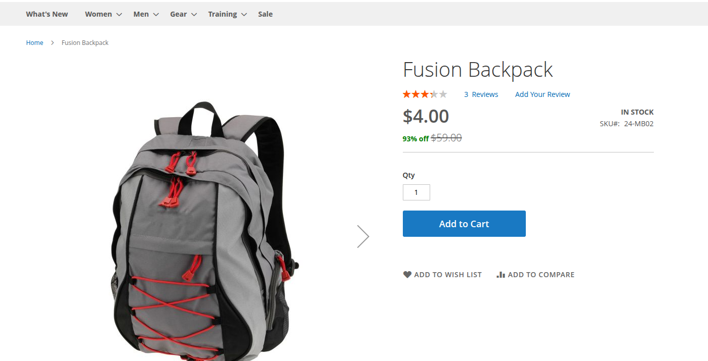
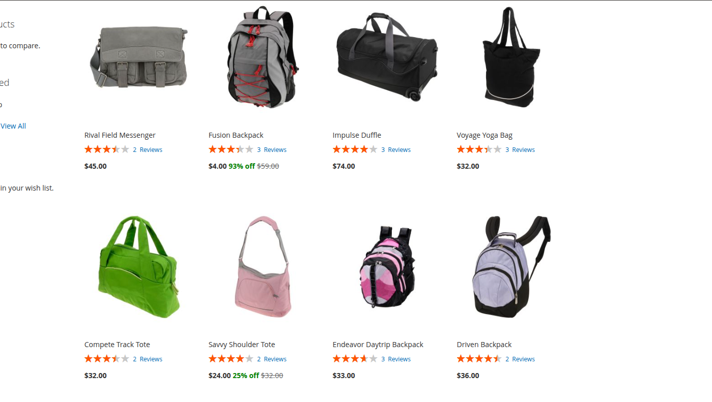

# M2Commerce: Magento 2 Discount Percentage Display
This Magento 2 module adds discount percentage labels directly to the product price display.It improves the customer shopping experience by clearly highlighting how much they can save, rounding discounts to the nearest multiple of 5 for a cleaner look.
Works with Magento 2.4.7 and PHP 8.3+

# Features
Show discount percentage on product listings and product detail pages.
Discount is automatically calculated based on regular and final prices.
Fully integrated with Magento's pricing rendering system.
Easily override the final price template via layout XML.

## Configuration
There are several configuration options for this extension, which can be found at CATALOG > Products > Edit any product > Set special price save and exit.

# ScreenShots



# Installation
You can download code from this repo under Magento® 2 following directory:
```app/code/M2Commerce/DiscountPercentage```

Enter following commands to enable the module:

```
php bin/magento module:enable M2Commerce_DiscountPercentage
php bin/magento setup:upgrade
php bin/magento setup:di:compile
php bin/magento cache:flush
```
